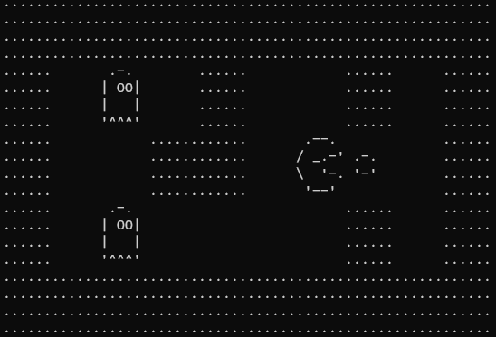

# Run Game

This is a simple game developed in C. The objective of the game is to run and avoid obstacles.



## How to Play

- Use the arrow keys to move the character.
- Avoid obstacles to score points.
- The game ends when you collide with an obstacle.

## Requirements

- C compiler (e.g., GCC)
- Operating system compatible with C (I used Windows)

## How to Compile

To compile the game, run the following command in the terminal:

```sh
gcc -o run-game run-game.c map.c ui.c
```

## How to Run

After compiling the game, run the following command in the terminal:

```sh
./run-game
```

## Project Structure

- `main.c`: Main game file.
- `game.h`: Header file with definitions and function declarations.
- `game.c`: Implementation of game functions.

## Contributions

Contributions are welcome! Feel free to open an issue or submit a pull request.

## License

This project is licensed under the MIT License. See the `LICENSE` file for more details.
